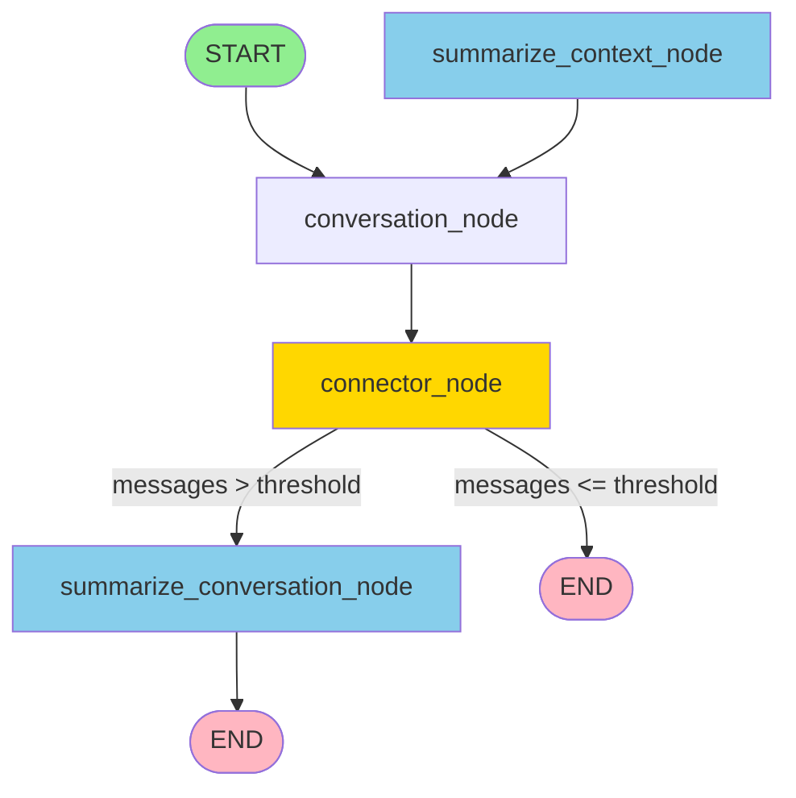

# Workflow Graph Diagram

## Visual Representation

```
                    ┌─────────┐
                    │  START  │
                    └────┬────┘
                         │
                         ▼
            ┌────────────────────────┐
            │  conversation_node     │
            └────────────┬───────────┘
                         │
                         ▼
            ┌────────────────────────┐
            │   connector_node       │
            └────────────┬───────────┘
                         │
                         │ (conditional edge)
                         │ should_summarize_conversation()
                         │
            ┌────────────┴────────────┐
            │                         │
            ▼                         ▼
┌───────────────────────────┐  ┌──────────────┐
│ summarize_conversation_   │  │     END      │
│        node               │  │  (terminate) │
└────────────┬──────────────┘  └──────────────┘
             │
             ▼
      ┌──────────────┐
      │     END      │
      └──────────────┘

      ┌────────────────────────┐
      │ summarize_context_node │
      └────────────┬───────────┘
                   │
                   │ (edge back to conversation_node)
                   │
                   ▼
      ┌────────────────────────┐
      │  conversation_node     │
      └────────────────────────┘
```

## Graph Structure

### Nodes:
1. **START** - Entry point
2. **conversation_node** - Main conversation processing
3. **connector_node** - Decision point
4. **summarize_conversation_node** - Summarizes conversation when needed
5. **summarize_context_node** - Summarizes context (can loop back)
6. **END** - Exit point

### Edges:
- `START → conversation_node` (unconditional)
- `conversation_node → connector_node` (unconditional)
- `connector_node → [conditional]` - Uses `should_summarize_conversation()`:
  - If messages > threshold: → `summarize_conversation_node`
  - Otherwise: → `END`
- `summarize_conversation_node → END` (unconditional)
- `summarize_context_node → conversation_node` (unconditional, creates loop)

### Conditional Logic:
The `should_summarize_conversation()` function checks if the message count exceeds `settings.TOTAL_MESSAGES_AFTER_SUMMARY`:
- **True**: Route to `summarize_conversation_node` to compress history
- **False**: Route to `END` to terminate

## Mermaid Diagram (for rendering in markdown viewers)



